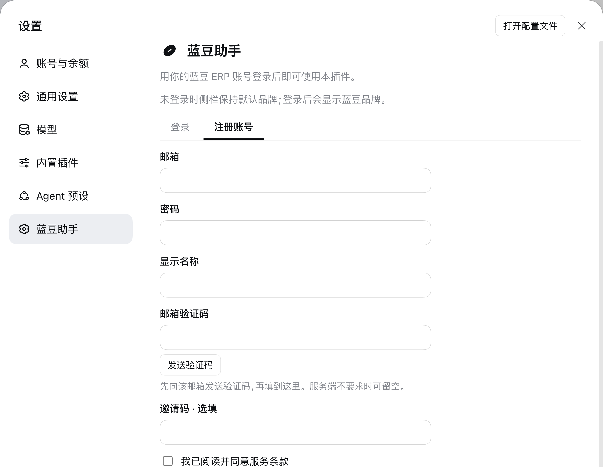

# 蓝豆助手 · dsh-landou-assistant

**DeepSeek Harness Desktop** 的插件。用你的蓝豆 ERP 账号登录后:

- 侧栏左上角的品牌名从 `DeepSeek Harness` 变成 **蓝豆助手 by DeepSeek Harness**(鲸鱼图标保持原样)
- 设置面板左栏的 **「蓝豆助手」** 页里是你的账号与后续设置

**未登录时插件完全不生效** —— 侧栏保持默认品牌。登录入口始终在
**设置 → 蓝豆助手**。

| 侧栏品牌名(登录后) | 登录 | 注册 |
|---|---|---|
|  |  |  |

> 只作用于 **Desktop** 版。已安装的 CLI 版不受任何影响。

---

## 账号

用**蓝豆 ERP 账号**(`dmaierp.com`)。没有账号就在同一页的「注册账号」标签里注册:
邮箱 + 密码 + 显示名称,可选用邮箱验证码与邀请码,注册前需勾选服务条款与跨境数据传输同意。

### 品牌名和登录是两件事

**装上插件,侧栏就会显示「蓝豆助手 by DeepSeek Harness」——不需要先登录。**

品牌名是插件的**存在标识**,不是受登录约束的功能。把一个插件做成"没登录就完全看不到",
用户会以为插件没装好(这个项目上真实发生过一次:品牌名曾经被绑在登录状态上,
未登录时完全不占用侧栏,结果看起来像故障)。

**登录门控落在设置页**:后续需要账号的功能放在 **设置 → 蓝豆助手** 里,
或者放在由它派生的贡献里。当前该页在未登录时显示注册/登录表单,登录后显示账号信息。

登录状态保存在本机,重启 Desktop 仍然有效,直到你点「退出登录」。

> 找不到设置入口?它不在侧栏列表里 —— 点**左下角的账号行**,菜单里选「设置 ⌘,」。

---

## 认证是怎么走的(以及为什么这么走)

```
浏览器半边  ──fetch('/landou-assistant/session/login')──▶  宿主半边
   (拿不到令牌)                                              │
                                                             │ 代打
                                                             ▼
                                              https://dmaierp.com/api/auth/login
```

**浏览器半边不能直连 ERP。** 实测该站的 CORS 预检:

```
OPTIONS /api/auth/login  →  400
  access-control-allow-credentials: true
  access-control-allow-methods: ...
  vary: Origin
  （没有 access-control-allow-origin）
```

`vary: Origin` 却不回 `allow-origin` 的含义是:服务端只对白名单源放行,
而 Desktop 的页面源是 `dsh-app://app`,不在其中。

所以请求由**宿主半边**发出。宿主路由挂在 DSH 的 webserver 上,而 Desktop 的 Electron 会把
`dsh-app://app` 下除静态资源外的**任意路径原样转发**给宿主
(`apps/desktop/src/web-document.ts` 的 `forwardWebRequest` 没有路径白名单)。
于是客户端用相对路径 `fetch` 即可做到同源、无 CORS;Web 载体下客户端页面本来就在宿主源上,
同一份代码同样成立。

**访问令牌永远不进浏览器。** 它只存在于宿主进程与
`$DSH_HOME/landou-assistant/session.json`(权限 `0600`)。
这与 DSH 自带的 `credentials-local` 是同一模型 —— 它同样是 harness home 下的私有文件,
而非系统钥匙串。浏览器能拿到的只有:

```json
{ "authenticated": true, "userId": "...", "displayName": "...", "expiresAt": 0 }
```

### 宿主路由

| 方法 | 路径 | 说明 |
|---|---|---|
| `GET` | `/landou-assistant/session` | 当前登录状态;令牌到期会自动续期 |
| `POST` | `/landou-assistant/session/login` | `{ email, password }` |
| `POST` | `/landou-assistant/session/register` | `{ email, password, displayName, verificationCode?, inviteCode?, acceptedTerms, acceptedCrossBorderTransfer }` |
| `POST` | `/landou-assistant/session/email-code` | `{ email, purpose: 'register' \| 'reset_password' }` |
| `POST` | `/landou-assistant/session/logout` | 撤销服务端会话并删除本地令牌 |

ERP 侧契约取自 `https://dmaierp.com/openapi.json`,请求一律带
`client_type: "landou_assistant"`。另外:

- **禁用重定向** —— 带着凭据的请求绝不跟随跳转离开既定主机。
- **令牌只在服务端明确否认时才清**(401/403)。网络错误保留会话,
  否则断网一次就会把用户踢下线。
- 请求体上限 64 KB,响应只回 JSON 且**不带任何 CORS 头**。
- 环境变量 `LANDOU_API_BASE_URL`(或 `ERP_API_BASE_URL`)可指向测试部署,
  默认 `https://dmaierp.com/api`。

### 登录门控怎么实现的

侧栏品牌位的注册**只在已登录时存在**:

```ts
// 未登录时 brandDisposer 为 undefined,这个占用根本不存在
brandDisposer = ctx.slots.inject('sidebar.brand.name', function* () {
  yield ctx.slots.register({ name: 'sidebar.brand.name', priority: -1 }, LandouBrandName)
})
```

`slots.inject` 返回 disposer,所以登出时能真正撤掉占用 ——
**官方品牌插件从未被禁用**,我们的注册消失后它自然重新成为唯一占用者。

设置页那一项**不受登录状态约束**:未登录的用户必须能在这里找到登录入口。

---

## 安装

三种方式,任选一种。装完**重启 Desktop 生效**。

### 一、在界面上装(推荐)

1. 侧栏点 **「插件」**
2. 点 **「添加插件」** → **「安装第三方插件」**
3. 在「包名或地址」里填:

   ```
   github:jinghoor/dsh-landou-assistant
   ```

4. 确认安装,然后重启 Desktop

### 二、让 Agent 装

在 Desktop 的对话里直接说:

> 用 plugin_manager 安装 `github:jinghoor/dsh-landou-assistant`,装到 desktop profile

### 三、命令行装

需要先装好 Desktop 自带的 `dsh` 命令(菜单 **Manage dsh Command… → Install**),然后:

```bash
dsh plugin --profile desktop add github:jinghoor/dsh-landou-assistant
```

装完**先完全退出 Desktop 再重开**。

> 不要用 npm 上同名包 —— 本插件不发布到 npm,只通过 Git 分发。

---

## 卸载

界面:侧栏「插件」→ 找到「蓝豆助手」→ 卸载。

命令行:`dsh plugin --profile desktop remove dsh-landou-assistant`。

---

## 为什么安装不需要构建

本仓库**提交了预构建产物 `lib/`**,并且**刻意不提供 `prepare` 脚本**。

DSH 的插件管理器对依赖的构建脚本有审批门槛(`allowBuilds`),需要用户明确批准才执行。
本插件用预构建产物绕开这一步:用户装完即可用,**不需要任何工具链,也不需要批准脚本执行**。

代价是改代码要记得重新构建并把 `lib/` 一起提交 —— 见下面的「开发」。

---

## 开发

```bash
git clone https://github.com/jinghoor/dsh-landou-assistant.git
cd dsh-landou-assistant

npx tsdown            # 构建到 lib/

git add lib && git commit -m "build: ..."
```

也可以用 DSH 仓库 checkout 里已经装好的构建器:
`<DSH checkout>/node_modules/.bin/tsdown`。

### 目录

```
├── package.json          dsh.bundle + dsh.client 双声明
├── cordis.patch.yml      bundle 层:插入宿主半边的 Loader entry
├── tsdown.config.ts      构建配置(纯对象导出,不 import 任何东西)
├── src/
│   ├── index.ts          宿主半边 —— 认证路由 + ERP 代理 + 令牌落盘
│   └── client/
│       ├── index.ts      浏览器半边 —— 注册两处贡献 + 登录门控
│       ├── session.ts    同源 API 客户端(唯一与宿主通信的通道)
│       ├── locales.ts    中英文案
│       ├── LandouMark.tsx             豆形标记(内联 SVG)
│       ├── LandouBrandName.tsx        侧栏品牌名组件
│       └── LandouSettingsSection.tsx  登录/注册/账号页
└── lib/                  预构建产物(随仓库提交)
```

### 改哪里

| 想改什么 | 改哪 |
|---|---|
| 品牌名文案 | `src/client/LandouBrandName.tsx` |
| 遮蔽优先级 | `src/client/index.ts` 的 `priority` |
| 连侧栏图标一起换 | 同时注册 `sidebar.brand.mark`(owner props 是 `{size: number}`) |
| 豆形标记形状 | `src/client/LandouMark.tsx` |
| 设置页导航位置 | `src/client/index.ts` 注册选项的 `order` |
| 导航项文案 | `src/client/locales.ts` 的 `nav` |
| 登录/注册界面 | `src/client/LandouSettingsSection.tsx` |
| 认证接口与令牌处理 | `src/index.ts`(宿主半边) |
| ERP 地址 | 环境变量 `LANDOU_API_BASE_URL`,或 `src/index.ts` 的 `ERP_API_BASE` |
| 登录门控范围 | `src/client/index.ts` 的 `syncBrand()` |

### 宽度退化

侧栏品牌名的空间很紧:实测侧栏 280px 时,宿主 `.brand` 只有 252px,
官方鲸鱼图标 + 间隙占掉 32px,留给品牌名的是 219px,而文案要 213px —— **只剩 6px 余量**。
父级链上是 `overflow: hidden`,不处理的话窄栏会**硬切**字符。

所以组件的退化顺序是显式声明的:

1. 「蓝豆助手」`flex-shrink: 0` —— 永不压缩
2. 「by DeepSeek Harness」`flex-shrink: 1` + `min-width: 0` + `text-overflow: ellipsis`
   —— 先被截短,窄栏下呈现为「蓝豆助手 by DeepS…」而不是切掉半个字

改文案时留意这个预算。

---

## 它怎么起作用的

两处都用 DSH 官方的扩展点,**不改任何官方包**。

### 侧栏品牌名 —— slot 优先级遮蔽

品牌位是两个**单占用 slot**:`sidebar.brand.mark`(图标)和 `sidebar.brand.name`(名字)。
官方插件 `ui-brand-official` 以默认优先级 **0** 占用它们。

单占用 slot 的规则是:同优先级重复注册抛错,**不同优先级是遮蔽关系,数值最低者渲染**
(`packages/client/ui-slots/src/index.ts`)。

所以本插件用 `priority: -1` 压过官方品牌名 —— 官方插件不报错、也无需禁用它。
只想换名字不想换图标,所以 `brand.mark` 完全不碰。

### 设置页 —— `settings.section` 列表 slot

设置契约的原话是 *"adding a setting never means editing the shell"* ——
设置外壳自己没有任何文案,导航身份全部由注册的选项给出:

```ts
ctx.slots.register({
  name: 'settings.section',
  id: 'landou-assistant',
  order: 30,
  label: () => t('nav'),
  locale: NS,
}, LandouSettingsSection)
```

### 客户端产物契约

DSH 的浏览器半边按 `dsh.client` 声明加载插件,产物必须是 loader 约定的闭包工厂包装:

```js
window.__ModuleLoader__.load({
  id: "dsh-landou-assistant",
  factory: (require) => {
    var module = { exports: {} };
    var exports = module.exports;
    /* ... */
    exports.apply = apply;
    exports.inject = inject;
    return module.exports;
  }
});
```

对外部依赖只有平台模块表那一组(`react/jsx-runtime` 等),其余全部内联。
type-only 导入会被完全擦除。

---

## 兼容性

针对 **DeepSeek Harness `0.2.1-alpha.1`** 开发与验证。

插件**刻意不声明 `peerDependencies`**。DSH 的兼容性检查只针对 `@deepseek-ai/dsh*` 的 peer
(`packages/boot/app-boot/src/plugin-compatibility.ts`),没有 peer 就永远通过 —— 这样不会因为
版本范围写法把插件误判为不兼容而挡住安装。代价是 DSH 大版本变更时不会有前置提示;
升级后如果界面没变化,先看 Desktop 日志里插件加载是否报错。

---

## 设置项导航图标:为什么插件给不了

设置面板左栏每个分区的图标**由外壳按分区 id 硬编码**,插件注入不了。
这不是偷懒,是当前 DSH 结构决定的 —— 三层原因,逐层收紧:

**一、图标不是 slot。** 外壳直接渲染一个纯函数的结果:

```tsx
// packages/client/ui-settings-general/src/client/SettingsRoot.tsx
function navIcon(id: string) {
  if (id === 'account') return <IconUserOutlineMedium ... />
  if (id === 'models')  return <IconDataOutlineMedium ... />
  // 认不出的 id 走兜底齿轮 —— 「通用设置」也走这里
  return <IconSettingsOutlineMedium className={css.navIcon} size={16} />
}
```

**二、注册选项传不进来。** 想给注册选项加个 `icon` 字段也做不到 ——
slot 核心在入队时会**重建** options 对象,只保留它认识的字段:

```ts
options: {
  ...(options.id !== undefined ? { id: options.id } : {}),
  ...(options.order !== undefined ? { order: options.order } : {}),
  ...(options.label !== undefined ? { label: options.label } : {}),
  ...(options.priority !== undefined ? { priority: options.priority } : {}),
},
```

未知字段被丢弃,所以插件无法"偷渡"图标过去。

**三、就算硬塞进去也是错的。** 设置分区列表是通过注入的 observable 投影给外壳的,
而 `packages/client/AGENTS.md` 明确规定:

> UI domains share JSON-compatible data and callbacks. Owner props, injected values,
> store state, and provide contributions use these values.
> **Route ReactNode content through a slot; do not add ReactNode-valued owner props or injected members.**

**结论:这不是本插件能修的东西,而是 DSH 上游缺的一个扩展点。** 正确的上游改法是
在 `ui-settings` 的 slots 契约里声明一个 keyed slot(例如 `settings.section.icon`,
按分区 id 派发),由 `ui-settings-general` 声明并渲染,`navIcon(id)` 退为 fallback。

**本插件刻意不做本地补丁版的图标**,理由是它会**破坏一致性**:
补丁只存在于你自己改过的 DSH 里,用户从 GitHub 装这个插件时他们的 DSH 没有那个 slot ——
图标只对你有、对用户没有。那正好违背这个插件存在的意义。

作为替代,品牌视觉落在**设置页内部**(标题旁的豆形标记),这对未经修改的 DSH 同样成立。

---

## 已知限制

- **只改侧栏品牌名**。标题栏、欢迎页、About 面板里的产品名是 Electron 壳或别的包的字面量,
  不在 slot 体系里。
- 设置项**导航图标**无法自定义,原因见上一节。
- **令牌以明文 JSON 存在 `0600` 文件里**(宿主用户可读)。这与 DSH 自带的
  `credentials-local` 同级别,但弱于系统钥匙串 —— 后者的接入(Keychain / DPAPI /
  Secret Service)尚未实现。本机同时被agent 工具进程以同一用户身份运行时,
  该文件对它们可读。
- 注册/登录界面目前**不做本地密码强度校验** —— 强度策略由 ERP 服务端裁决,
  界面上只做必填校验。
- 尚未实现**找回密码**。ERP 有 `/api/auth/reset-password` 与
  `/api/auth/password-reset/availability`,宿主已能代理 `/session/email-code`
  (`purpose: 'reset_password'`),但界面上还没有对应流程。
- **不发布到 npm**,仅通过 Git 安装。

## 许可

MIT
