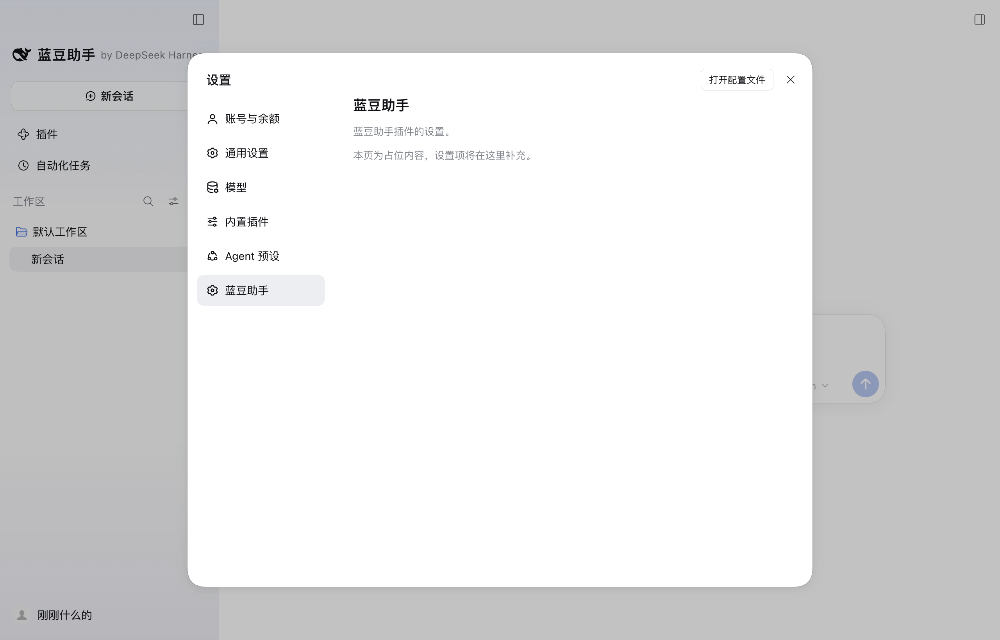

# 蓝豆助手 · dsh-landou-assistant

**DeepSeek Harness Desktop** 的插件。装上以后:

- 侧栏左上角的品牌名从 `DeepSeek Harness` 变成 **蓝豆助手 by DeepSeek Harness**(鲸鱼图标保持原样)
- 设置面板左栏多出一个 **「蓝豆助手」** 设置页(当前为占位,后续放蓝豆助手自己的设置)

| 侧栏品牌名 | 设置页 |
|---|---|
|  |  |

> 只作用于 **Desktop** 版。已安装的 CLI 版不受任何影响。

---

## 安装

三种方式,任选一种。装完**重启 Desktop 生效**。

### 一、在界面上装(推荐)

1. 侧栏点 **「插件」**
2. 点 **「添加插件」** → **「安装第三方插件」**
3. 在「包名或地址」里填:

   ```
   github:jinghoor/dsh-landou-assistant
   ```

4. 确认安装,然后重启 Desktop

### 二、让 Agent 装

在 Desktop 的对话里直接说:

> 用 plugin_manager 安装 `github:jinghoor/dsh-landou-assistant`,装到 desktop profile

### 三、命令行装

需要先装好 Desktop 自带的 `dsh` 命令(菜单 **Manage dsh Command… → Install**),然后:

```bash
dsh plugin --profile desktop add github:jinghoor/dsh-landou-assistant
```

装完**先完全退出 Desktop 再重开**。

> 不要用 npm 上同名包 —— 本插件不发布到 npm,只通过 Git 分发。

---

## 卸载

界面:侧栏「插件」→ 找到「蓝豆助手」→ 卸载。

命令行:`dsh plugin --profile desktop remove dsh-landou-assistant`。

---

## 为什么安装不需要构建

本仓库**提交了预构建产物 `lib/`**,并且**刻意不提供 `prepare` 脚本**。

DSH 的插件管理器对依赖的构建脚本有审批门槛(`allowBuilds`),需要用户明确批准才执行。
本插件用预构建产物绕开这一步:用户装完即可用,**不需要任何工具链,也不需要批准脚本执行**。

代价是改代码要记得重新构建并把 `lib/` 一起提交 —— 见下面的「开发」。

---

## 开发

```bash
git clone https://github.com/jinghoor/dsh-landou-assistant.git
cd dsh-landou-assistant

npx tsdown            # 构建到 lib/

git add lib && git commit -m "build: ..."
```

也可以用 DSH 仓库 checkout 里已经装好的构建器:
`<DSH checkout>/node_modules/.bin/tsdown`。

### 目录

```
├── package.json          dsh.bundle + dsh.client 双声明
├── cordis.patch.yml      bundle 层:插入宿主半边的 Loader entry
├── tsdown.config.ts      构建配置(纯对象导出,不 import 任何东西)
├── src/
│   ├── index.ts          宿主半边 —— 空 apply
│   └── client/
│       ├── index.ts      浏览器半边 —— 注册两处贡献
│       ├── locales.ts    中英文案
│       ├── LandouBrandName.tsx        侧栏品牌名组件
│       └── LandouSettingsSection.tsx  设置页组件
└── lib/                  预构建产物(随仓库提交)
```

### 改哪里

| 想改什么 | 改哪 |
|---|---|
| 品牌名文案 | `src/client/LandouBrandName.tsx` |
| 遮蔽优先级 | `src/client/index.ts` 的 `priority` |
| 连图标一起换 | 同时注册 `sidebar.brand.mark`(owner props 是 `{size: number}`) |
| 设置页导航位置 | `src/client/index.ts` 注册选项的 `order` |
| 导航项文案 | `src/client/locales.ts` 的 `nav` |
| 占位页内容 | `src/client/LandouSettingsSection.tsx` |

---

## 它怎么起作用的

两处都用 DSH 官方的扩展点,**不改任何官方包**。

### 侧栏品牌名 —— slot 优先级遮蔽

品牌位是两个**单占用 slot**:`sidebar.brand.mark`(图标)和 `sidebar.brand.name`(名字)。
官方插件 `ui-brand-official` 以默认优先级 **0** 占用它们。

单占用 slot 的规则是:同优先级重复注册抛错,**不同优先级是遮蔽关系,数值最低者渲染**
(`packages/client/ui-slots/src/index.ts`)。

所以本插件用 `priority: -1` 压过官方品牌名 —— 官方插件不报错、也无需禁用它。
只想换名字不想换图标,所以 `brand.mark` 完全不碰。

### 设置页 —— `settings.section` 列表 slot

设置契约的原话是 *"adding a setting never means editing the shell"* ——
设置外壳自己没有任何文案,导航身份全部由注册的选项给出:

```ts
ctx.slots.register({
  name: 'settings.section',
  id: 'landou-assistant',
  order: 30,
  label: () => t('nav'),
  locale: NS,
}, LandouSettingsSection)
```

### 客户端产物契约

DSH 的浏览器半边按 `dsh.client` 声明加载插件,产物必须是 loader 约定的闭包工厂包装:

```js
window.__ModuleLoader__.load({
  id: "dsh-landou-assistant",
  factory: (require) => {
    var module = { exports: {} };
    var exports = module.exports;
    /* ... */
    exports.apply = apply;
    exports.inject = inject;
    return module.exports;
  }
});
```

对外部依赖只有平台模块表那一组(`react/jsx-runtime` 等),其余全部内联。
type-only 导入会被完全擦除。

---

## 兼容性

针对 **DeepSeek Harness `0.2.1-alpha.1`** 开发与验证。

插件**刻意不声明 `peerDependencies`**。DSH 的兼容性检查只针对 `@deepseek-ai/dsh*` 的 peer
(`packages/boot/app-boot/src/plugin-compatibility.ts`),没有 peer 就永远通过 —— 这样不会因为
版本范围写法把插件误判为不兼容而挡住安装。代价是 DSH 大版本变更时不会有前置提示;
升级后如果界面没变化,先看 Desktop 日志里插件加载是否报错。

---

## 已知限制

- 只改**侧栏品牌名**。标题栏、欢迎页、About 面板里的产品名是 Electron 壳或别的包的字面量,
  不在 slot 体系里。
- 设置页的**图标**由设置外壳按分区 id 硬编码,插件无法自定义,当前走兜底图标。
- 设置页目前是**占位**,没有任何写入行为。
- **不发布到 npm**,仅通过 Git 安装。

## 许可

MIT
